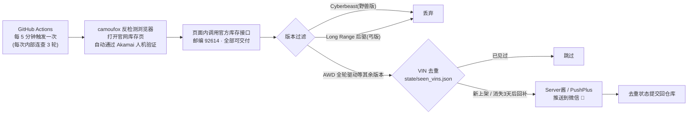

# 🛻 Cybertruck 官方库存监控(微信提醒)

盯着 **tesla.com 官方库存**里的全新 Cybertruck(邮编 92614、"All deliverable 全部可交付"范围),**排除 Cyberbeast 野兽版和 Long Range 后驱丐版**,一有新车上架就把车型、价格、优惠、下单链接推到你的**微信**。免费跑在 GitHub Actions(GitHub 提供的免费定时任务平台)上,7×24 小时无人值守。

## 🗺️ 工作原理



- 🕵️ **为什么要用 camoufox(一个专门伪装成真人浏览器的 Firefox)?** 特斯拉官网被 Akamai(一家反爬虫服务商)保护,普通脚本、甚至普通自动化浏览器都会被拦截(实测 403/挑战页)。camoufox 能自动通过验证,本地和云端实测都能稳定拿到数据。
- 🔁 **为什么任务内部要"连查 18 轮"?** GitHub 定时任务名义最短 5 分钟,实测对新仓库限流严重(有时 1 小时+ 才调度一次);每次任务内部每约 70 秒查一轮、持续约 20 分钟,用"少次数×长时间"对冲限流。检查期内新车约 1~2 分钟发现,空窗期取决于 GitHub 调度(通常几十分钟)。**想要全天秒级,请再在本地跑 `--loop 60` 常驻,两边互为备份。**
- 🔓 **仓库要用 Public(公开)**:公开仓库的 Actions 免费时长不限量;私有仓库每月只有 2000 分钟,撑不住这个频率。代码里没有任何密钥(密钥放在仓库 Secrets 里),公开无妨;介意邮编公开的话可把 workflow 里的 `ZIP_CODE` 也改成 Secret。

## 🚀 部署三步(约 10 分钟)

### ① 拿一个"推送到微信"的钥匙(Server酱)

- 📱 打开 [sct.ftqq.com](https://sct.ftqq.com),用微信扫码登录,复制你的 **SendKey**(`SCT` 开头的一串)。
- ℹ️ Server酱是一个把消息推到你微信(通过"方糖"服务号)的免费服务,免费版每天限 5 条——本监控每轮合并成 1 条消息,正常完全够用。
- 🔄 想要更大额度或双保险,可再注册 [pushplus.plus](https://www.pushplus.plus)(同类服务,免费额度更大)拿一个 token,两个都配上。

### ② 建 GitHub 仓库并放入密钥

```bash
# 在本项目目录执行(需已安装 GitHub CLI 并 gh auth login)
gh repo create tesla-ct-monitor --public --source . --push
gh secret set SERVERCHAN_SENDKEY --body "SCT你的Key"
# 可选:gh secret set PUSHPLUS_TOKEN --body "你的token"
```

### ③ 验证

```bash
gh workflow run "Cybertruck 库存监控"   # 手动触发一次(之后每 5 分钟自动跑)
```

- ✅ 首次运行会把**当前全部符合条件的库存**推给你一次(顺便验证链路),之后只在有新车/回补时才提醒。
- 🧪 也可以本地先验证微信通道:把 `config.example.json` 复制为 `config.json` 填入 SendKey,然后 `python tesla_ct_monitor.py --test-notify`。

## 💻 本地运行(可选,速度更快)

```bash
pip install -r requirements.txt
python -m camoufox fetch          # 首次需下载浏览器(约 500MB)
python tesla_ct_monitor.py --loop 60   # 常驻:每约 60 秒查一次,比云端更接近"秒级"
```

- ⚡ 家用宽带 IP 抓取成功率最高;想"立马知道"可以本地常驻 + 云端兜底同时跑(两边独立去重,同一辆车可能各收到一条,可接受)。
- 🧪 调试:`--dry-run` 只打印不推送;`--headed` 显示浏览器窗口。

## ⚙️ 可调参数(环境变量或 config.json)

| 参数 | 默认 | 说明 |
|---|---|---|
| `ZIP_CODE` | `92614` | 搜索邮编(交付/运费按它算) |
| `EXCLUDE_DEMO` | `0` | 设 `1` 排除展车(默认展车也提醒并标注里程) |
| `RESURFACE_DAYS` | `3` | 车辆从库存消失超过 N 天后重新出现 → 按"回补"再提醒 |
| `FAIL_ALERT_THRESHOLD` | `10` | 连续失败 N 次给你发一条告警(24 小时内不重复) |
| `FETCH_MODES` | `headless` | 抓取模式顺序;云端用 `headless,virtual`(后者是带虚拟显示器的备用模式) |

## 🔍 过滤规则(想改的话在 `classify_vehicle` 里)

- ✅ **保留**:`CT_AWD`(含 "Cybertruck All-Wheel Drive"、"Premium All-Wheel Drive" 等全轮驱动版本)
- ❌ **排除**:`CT_CYB` / 名称含 Cyberbeast(野兽版)
- ❌ **排除**:后驱 / Long Range / Standard Range 字样(丐版)
- ❓ **未知新版本**:照样提醒但带"❓未知版本"标签(宁可多报不漏报)

## 🧰 故障排查

- 🔴 **重复收到同一辆车的通知** → 去重状态没保存成功。看 Actions 日志"保存去重状态"一步是否报错(仓库 Settings → Actions → General → Workflow permissions 需为 **Read and write**)。
- ⚠️ **微信收到"连续失败"告警** → 多半是云端 IP 被 Akamai 拉黑。先看该轮 Actions 日志确认错误;可等它自愈,或改在本地/自托管 runner 跑。本地 `python tesla_ct_monitor.py --dry-run` 正常即代码无恙。
- 😶 **一直没消息** → 库存本来就少(写此文时全美符合条件的只有 2 辆);跑 `--dry-run` 看当前匹配结果;确认 Server酱当日 5 条额度没用完。
- 🐢 **通知比官网慢几分钟** → GitHub 定时任务高峰期排队属正常;要更快就本地 `--loop 60` 常驻。

## 📝 说明

- 🤝 仅个人自用的库存查询频率(约 1.5~2 分钟一次、每次一个请求),与正常浏览网页相当,请勿改成高频轰炸。
- 🧾 测试:`python test_monitor.py`(19 个用例,覆盖过滤/去重/回补/失败重试)。
